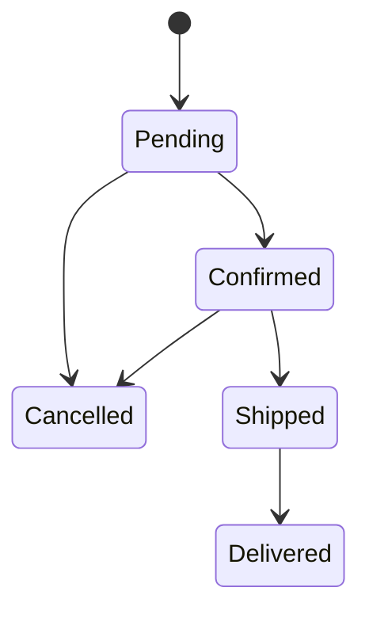

kFSM is Finite State Machinery for Kotlin.

[](https://central.sonatype.com/namespace/app.cash.kfsm)

## Overview

kFSM provides a type-safe, production-ready state machine framework with:

- **Pure decision logic** - Transitions return `Decision` objects describing state changes and effects
- **Transactional outbox** - Effects stored atomically with state changes for reliable delivery
- **Effect processing** - Background processor executes effects and chains multi-step workflows
- **Type safety** - Compile-time verification of valid state transitions

## Quick Start

There are five key components:

1. **State** - The possible conditions of your entity, with allowed transitions
2. **Value** - The entity that moves between states  
3. **Effect** - Side effects to execute (emails, API calls, etc.)
4. **Transition** - Pure `decide()` functions that determine state changes and effects
5. **StateMachine** - Validates and applies transitions atomically

### Example: Order Workflow



#### Define States

```kotlin
sealed class OrderState : State<OrderState>() {
    data object Pending : OrderState() {
        override fun transitions() = setOf(Confirmed, Cancelled)
    }
    data object Confirmed : OrderState() {
        override fun transitions() = setOf(Shipped, Cancelled)
    }
    data object Shipped : OrderState() {
        override fun transitions() = setOf(Delivered)
    }
    data object Delivered : OrderState()
    data object Cancelled : OrderState()
}
```

#### Define the Value

```kotlin
data class Order(
    override val id: String,
    override val state: OrderState,
    val email: String,
    val total: Long
) : Value<String, Order, OrderState> {
    override fun update(newState: OrderState) = copy(state = newState)
}
```

#### Define Effects

```kotlin
sealed class OrderEffect : Effect {
    data class SendConfirmationEmail(val orderId: String, val email: String) : OrderEffect()
    data class ChargePayment(val orderId: String, val amount: Long) : OrderEffect()
    data class NotifyWarehouse(val orderId: String) : OrderEffect()
}
```

#### Define Transitions

Transitions use pure `decide()` functions that return a `Decision`:

```kotlin
class ConfirmOrder(private val paymentId: String) : Transition<String, Order, OrderState, OrderEffect>(
    from = OrderState.Pending,
    to = OrderState.Confirmed
) {
    override fun decide(value: Order): Decision<OrderState, OrderEffect> =
        Decision.accept(
            state = OrderState.Confirmed,
            effects = listOf(
                OrderEffect.SendConfirmationEmail(value.id, value.email),
                OrderEffect.ChargePayment(value.id, value.total)
            )
        )
}

class ShipOrder(private val trackingNumber: String) : Transition<String, Order, OrderState, OrderEffect>(
    from = OrderState.Confirmed,
    to = OrderState.Shipped
) {
    override fun decide(value: Order): Decision<OrderState, OrderEffect> =
        Decision.accept(
            state = OrderState.Shipped,
            effects = listOf(OrderEffect.NotifyWarehouse(value.id))
        )
}
```

#### Implement Effect Handler

```kotlin
class OrderEffectHandler(
    private val emailService: EmailService,
    private val paymentService: PaymentService
) : EffectHandler<String, Order, OrderState, OrderEffect> {

    override fun handle(valueId: String, effect: OrderEffect) = when (effect) {
        is OrderEffect.SendConfirmationEmail -> runCatching {
            emailService.send(effect.email, "Order confirmed!")
            EffectOutcome.Completed
        }
        is OrderEffect.ChargePayment -> runCatching {
            val txId = paymentService.charge(effect.amount)
            EffectOutcome.TransitionProduced(valueId, PaymentReceived(txId))
        }
        is OrderEffect.NotifyWarehouse -> runCatching {
            warehouseService.notify(valueId)
            EffectOutcome.Completed
        }
    }
}
```

#### Wire It Together

```kotlin
// Create components
val repository = JooqOrderRepository(dsl)
val outbox = JooqOutbox(dsl, OrderEffectSerializer.instance)
val stateMachine = StateMachine(repository)
val effectProcessor = EffectProcessor(outbox, effectHandler, stateMachine, repository::findById)

// Apply a transition
val result = stateMachine.transition(order, ConfirmOrder(paymentId))

// Process effects (run in background)
effectProcessor.processAll()
```

## Modules

### Core Library (`lib`)

The main state machine implementation:

```kotlin
dependencies {
    implementation("app.cash.kfsm:kfsm:<version>")
}
```

### jOOQ Integration (`lib-jooq`)

Production-ready outbox utilities using jOOQ:

```kotlin
dependencies {
    implementation("app.cash.kfsm:kfsm-jooq:<version>")
}
```

Provides:
- **JooqOutbox** - `SELECT ... FOR UPDATE SKIP LOCKED` for concurrent processing
- **PollingEffectProcessor** - Background processor with exponential backoff
- **MoshiOutboxSerializer** - Serialization for sealed class effects
- **OutboxSchema** - DDL for MySQL and PostgreSQL

## Key Features

### Pure Decision Logic

Transitions are pure functions, making them easy to test:

```kotlin
@Test
fun `confirm order produces email and payment effects`() {
    val order = Order(id = "123", state = Pending, email = "test@example.com", total = 100)
    
    val decision = ConfirmOrder("pay-456").decide(order)
    
    decision.shouldBeInstanceOf<Decision.Accept<*, *>>()
    decision.state shouldBe Confirmed
    decision.effects shouldContain OrderEffect.SendConfirmationEmail("123", "test@example.com")
}
```

### Transactional Outbox Pattern

Effects are stored atomically with state changes:
- At-least-once delivery semantics
- Survives crashes and deployments  
- Enables reliable multi-step workflows

### Effect Outcomes

Effects can return different outcomes:

| Outcome | Behavior |
|---------|----------|
| `TransitionProduced` | Apply follow-up transition, mark processed |
| `Completed` | Mark processed (terminal effect) |
| `FailedWithTransition` | Transition to error state, mark processed |
| `Result.failure()` | Mark failed for retry |

### Awaitable Workflows

For synchronous-style APIs over async workflows:

```kotlin
val awaitable = AwaitableStateMachine(stateMachine, pendingRequestStore) { state ->
    state is OrderState.Delivered || state is OrderState.Cancelled
}

// Suspends until terminal state or timeout
val result = awaitable.transitionAndAwait(order, ConfirmOrder(paymentId), 30.seconds)
```

## Safety

kFSM validates your state machine:

1. **Compile-time**: Transitions must match declared state paths
2. **Runtime**: Invalid transitions return errors, no side effects executed
3. **Idempotent**: Re-applying a transition to an already-transitioned value is a no-op

### State Invariants

Define invariants that must hold for each state:

```kotlin
sealed class OrderState : State<OrderState>() {
    data object Confirmed : OrderState() {
        override fun transitions() = setOf(Shipped, Cancelled)
        override fun invariants() = listOf(
            invariant("Order must have payment") { it.paymentId != null }
        )
    }
}
```

## Documentation

- **API docs**: [https://block.github.io/kfsm](https://block.github.io/kfsm)
- **Changelog**: [CHANGELOG.md](CHANGELOG.md)
- **Examples**: [example/](example/) module
- **Implementation guide**: [docs/implementation_guide.md](docs/implementation_guide.md)
- **Contributing**: [CONTRIBUTING.md](CONTRIBUTING.md)

## Building

> [!NOTE]
> kFSM uses [Hermit](https://cashapp.github.io/hermit/).
>
> Hermit ensures that your team, your contributors, and your CI have the same consistent tooling. Here are
> the [installation instructions](https://cashapp.github.io/hermit/usage/get-started/#installing-hermit).
>
> [Activate Hermit](https://cashapp.github.io/hermit/usage/get-started/#activating-an-environment) either
> by [enabling the shell hooks](https://cashapp.github.io/hermit/usage/shell/) (one-time only, recommended) or
> manually sourcing the env with `. ./bin/activate-hermit`.

```shell
gradle build
```
