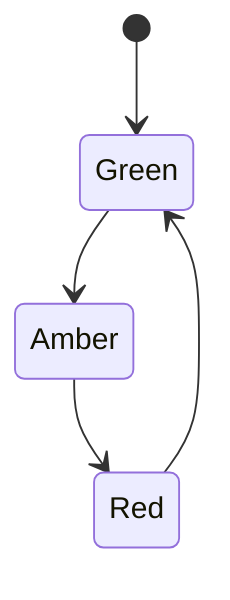

kFSM is Finite State Machinery for Kotlin.

[](https://central.sonatype.com/namespace/app.cash.kfsm)

## How to use

There are four key components to building your state machine.

1. The nodes representing different states in the machine - `State`
2. The type to be transitioned through the machine - `Value`
3. The effects that are defined by transitioning from one state to the next - `Transition`
4. A transitioner, which can be customised when you need to define pre and post transition hooks - `Transitioner`

Let's build a state machine for a traffic light.



### State

The states are a collection of related classes that define a distinct state that the value can be in. They also define
which states are valid next states.

```kotlin
sealed class Color(to: () -> Set<Color>) : app.cash.kfsm.State<Color>(to)
data object Green : Color({ setOf(Amber) })
data object Amber : Color({ setOf(Red) })
data object Red : Color({ setOf(Green) })
```

> [!IMPORTANT]
> Be sure to define your state constructor with _functions_ rather than literal values 
> if you require cycles in your state machine. Otherwise, you are likely to encounter
> null pointer exceptions from the Kotlin runtime's inability to define the types.

### Value

The value is responsible for knowing and updating its current state. Each value must have a unique identifier.

```kotlin
data class Light(override val state: Color, override val id: String) : Value<String, Light, Color> {
    override fun update(newState: Color): Light = copy(state = newState)
}
```

### Transition

Types that provide the required side-effects that define a transition in the machine.

```kotlin
abstract class ColorChange(
    from: States<Color>,
    to: Color
) : Transition<String, Light, Color>(from, to) {
    // Convenience constructor for when the from set has only one value
    constructor(from: Color, to: Color) : this(States(from), to)
}

class Go(private val camera: Camera) : ColorChange(from = Red, to = Green) {
    override suspend fun effect(value: Light) = camera.disable()
}

object Slow : ColorChange(from = Green, to = Amber)

class Stop(private val camera: Camera) : ColorChange(from = Amber, to = Red) {
    override suspend fun effect(value: Light) = camera.enable()
}
```

### Transitioner

Moving a value from one state to another is done by the transitioner. We provide it with a function that declares how to
persist values.

```kotlin
class LightTransitioner(
    private val database: Database
) : Transitioner<String, ColorChange, Light, Color>() {
 
    override suspend fun persist(value: Light, change: ColorChange): Result<Light> = database.update(value)
}
```

Each time a transition is successful, the persist function will be called.

#### Pre and Post Transition Hooks

It is sometimes necessary to execute effects before and after a transition. These can be defined on the transitioner.

```kotlin
class LightTransitioner ...  {
    
    // ...
    
    override suspend fun preHook(value: V, via: T): Result<Unit> = runCatching {
        globalLock.lock(value)
    }

    override suspend fun postHook(from: S, value: V, via: T): Result<Unit> = runCatching {
        globalLock.unlock(value)
        notificationService.send(via.successNotifications())
    }
}
```

### Transitioning

With the state machine and transitioner defined, we can progress any value through the machine by using the
transitioner.

```kotlin
val transitioner = LightTransitioner(database)
val greenLight: Result<Light> = transitioner.transition(redLight, Go)
```

### Dynamic State Selection

Sometimes you need to determine the next state dynamically based on the current value's state and other conditions. The `advance` method allows you to automatically progress to the next state using a state selector, without explicitly specifying the target state.

First, define a state selector for each state that needs dynamic transitions:

```kotlin
class TrafficStateSelector(private val clock: Clock) : NextStateSelector<String, Light, Color> {
    override fun apply(value: Light): Result<Color> = when (value.state) {
        is Green -> Result.success(Amber)
        is Amber -> Result.success(Red)
        is Red -> when {
            timeOfDay.hour in 23..5 -> Result.success(Green) // Less traffic at night
            else -> Result.failure(IllegalStateException("Too much traffic to change to Green"))
        }
    }
}
```

Then create your state machine with the selectors using the `fsm` DSL:

```kotlin
val selector = TrafficStateSelector(clock)
val stateMachine = fsm<String, Light, Color>(LightTransitioner(database)) {
    Green.becomes(selector) {
        Amber via colorChange
    }
    Amber.becomes(selector) {
        Red via colorChange
    }
    Red.becomes(selector) {
        Green via colorChange
    }
}

// Advance to the next state automatically
val nextLight: Result<Light> = stateMachine.advance(currentLight)
```

In this case, because there are no branching transitions, the selector can be omitted and the only possible transition
will be invoked on `advance`:

```kotlin
val stateMachine = fsm<String, Light, Color>(LightTransitioner(database)) {
    Green.becomes {
        Amber via Slow
    }
    Amber.becomes {
        Red via stop
    }
    Red.becomes {
        Green via Go
    }
}
```


The `advance` method will:
1. Use the selector for the current state to determine the next state
2. Automatically transition to that state if a valid transition exists
3. Return a failure if no selector exists or the transition is invalid

This is particularly useful when:
- The next state depends on runtime conditions
- You want to encapsulate transition logic in a single place
- You need to implement complex state selection rules

### Putting it all together

```kotlin
// The state
sealed class Color(to: () -> Set<Color>) : app.cash.kfsm.State<Color>(to)
data object Green : Color({ setOf(Amber) })
data object Amber : Color({ setOf(Red) })
data object Red : Color({ setOf(Green) })

// The value
data class Light(override val state: Color, override val id: String) : Value<String, Light, Color> {
    override fun update(newState: Color): Light = copy(state = newState)
}

// The transitions
abstract class ColorChange(
    from: States<Color>,
    to: Color
) : Transition<String, Light, Color>(from, to) {
    // Convenience constructor for when the from set has only one value
    constructor(from: Color, to: Color) : this(States(from), to)
}
class Go(private val camera: Camera) : ColorChange(from = Red, to = Green) {
    override suspend fun effect(value: Light) = camera.disable()
}
object Slow : ColorChange(from = Green, to = Amber)
class Stop(private val camera: Camera) : ColorChange(from = Amber, to = Red) {
    override suspend fun effect(value: Light) = camera.enable()
}

// The transitioner
class LightTransitioner(
    private val database: Database
) : Transitioner<String, ColorChange, Light, Color>() {
    override suspend fun persist(value: Light, change: ColorChange): Result<Light> = database.update(value)
}

// main ...
val transitioner = LightTransitioner(database)
val greenLight: Result<Light> = transitioner.transition(redLight, Go)
```

### More examples

See [lib/src/test/kotlin/app/cash/kfsm/exemplar](https://github.com/block/kfsm/tree/main/lib/src/test/kotlin/app/cash/kfsm/exemplar)
for a different example of how to use this library.

### Coroutine Support

If you are using coroutines and need suspending function support, you can extend `TransitionerAsync` instead of
`Transitioner` and implement any suspending transition effects via the `Transition.effectAsync` method.

### Transactional Outbox Pattern

kFSM supports the transactional outbox pattern for reliable execution of side effects in distributed systems. This pattern ensures that state changes and their associated effects are persisted atomically, preventing lost updates even in the face of system failures.

**Why use the outbox pattern?**
- Guarantees that side effects (emails, webhooks, events) are never lost
- Ensures effects are persisted in the same transaction as state changes
- Enables asynchronous processing of effects
- Provides at-least-once delivery semantics

**What kFSM provides:**
- Core interfaces: `DeferrableEffect`, `OutboxHandler`, `OutboxMessage`
- Integration with `Transitioner` for atomic persistence
- You implement the message processing logic based on your requirements

**Quick Example:**

```kotlin
// 1. Make your transition deferrable
class SendConfirmation(from: OrderState, to: OrderState, private val email: String)
    : OrderTransition(from, to), DeferrableEffect<String, Order, OrderState> {

    override fun effect(value: Order): Result<Order> {
        emailService.send(email, "Order confirmed!")
        return Result.success(value)
    }

    override fun serialize(value: Order): Result<EffectPayload> = Result.success(
        EffectPayload(
            effectType = "send_email",
            data = """{"email":"$email"}"""
        )
    )

    override val effectType = "send_email"
}

// 2. Configure your transitioner with an outbox handler
class OrderTransitioner(database: Database) : Transitioner<...>() {
    override val outboxHandler = DatabaseOutboxHandler(database)

    override fun persistWithOutbox(
        from: OrderState,
        value: Order,
        via: OrderTransition,
        outboxMessages: List<OutboxMessage<String>>
    ): Result<Order> = database.transaction {
        database.save(value)                    // Save state
        outboxMessages.forEach { database.saveOutbox(it) }  // Save effects
        Result.success(value)
    }
}

// 3. Implement your own processor to execute effects asynchronously
class OrderEffectProcessor(private val database: Database, private val emailService: EmailService) {
    suspend fun processPending() {
        val pending = database.getPendingOutboxMessages(limit = 100)
        pending.forEach { message ->
            try {
                database.updateMessageStatus(message.id, OutboxStatus.PROCESSING)
                val data = Json.decodeFromString<Map<String, String>>(message.effectPayload.data)
                when (message.effectPayload.effectType) {
                    "send_email" -> emailService.send(data["email"]!!, "Order confirmed!")
                }
                database.updateMessageStatus(message.id, OutboxStatus.COMPLETED)
            } catch (e: Exception) {
                // Handle retry logic
            }
        }
    }
}

// In a background job
scope.launch {
    while (isActive) {
        processor.processPending()
        delay(1000)
    }
}
```

Effects implementing `DeferrableEffect` are captured during the transition and stored in the outbox instead of being executed immediately. Your background processor then executes these effects asynchronously, providing reliable delivery even if the system fails.

For a complete guide including database schema and best practices, see [docs/outbox_pattern.md](docs/outbox_pattern.md).

## Safety

How does kFSM help validate the correctness of your state machine and your values?

1. It is impossible to define a Transition that does not comply with the transitions defined in the States. For example,
   a transition that attempts to define an arrow between `Red` and `Amber` will fail at construction.
2. If a value has already transitioned to the target state, then a subsequent request will not execute the transition a
   second time. The result will be success. I.e. it is a no-op.
    1. (unless you have defined a circular/self-transition, in which case it will)
3. If a value is in a state unrelated to the executed transition, then the result will be an error and no effect will be
   executed.

### State Invariants

kFSM supports defining invariants that must hold true for a value in a particular state. These invariants are validated 
both when checking if a value can be in a state and during transitions.

```kotlin
sealed class OrderState(
    transitionsFn: () -> Set<OrderState>,
    invariants: List<Invariant<String, Order, OrderState>> = emptyList()
) : State<String, Order, OrderState>(transitionsFn, invariants) {
    object Draft : OrderState(
        transitionsFn = { setOf(Submitted) },
        invariants = listOf(
            invariant("Order must have at least one item") { it.items.isNotEmpty() },
            invariant("Order total must be positive") { it.total > BigDecimal.ZERO }
        )
    )
    
    object Submitted : OrderState(
        transitionsFn = { setOf(Processing) },
        invariants = listOf(
            invariant("Order must have a shipping address") { it.shippingAddress != null }
        )
    )
    
    // ... other states ...
}
```

Invariants are defined using the `invariant` DSL function, which takes a descriptive message and a predicate function. 
When an invariant fails, a `PreconditionNotMet` exception is thrown with the provided message.

The transitioner will validate invariants in the following order:
1. Apply the transition effect
2. Validate the target state's invariants
3. Update the state
4. Persist the value

This ensures that target state's invariants are satisfied during the transition.

### Testing your state machine

The utility `StateMachine.verify` will assert that a defined state machine is valid - i.e. that all states are visited
from a given starting state.

```kotlin
StateMachine.verify(Green) shouldBeRight true
```

### Document your state machine

The utility `StateMachine.mermaid` will generate a mermaid diagram of your state machine. This can be rendered in markdown.
The diagram of `Color` above was created using this utility.

```kotlin
StateMachine.mermaid(Green) shouldBeRight """stateDiagram-v2
    [*] --> Green
    Amber --> Red
    Green --> Amber
    Red --> Green
    """.trimMargin()
```

## Documentation

The API documentation is published with each release
at [https://block.github.io/kfsm](https://block.github.io/kfsm)

See a list of changes in each release in the [CHANGELOG](CHANGELOG.md).

See [lib/src/test/kotlin/app/cash/kfsm/exemplar](https://github.com/block/kfsm/tree/main/lib/src/test/kotlin/app/cash/kfsm/exemplar)
for a different example of how to use this library.

For details on contributing, see the [CONTRIBUTING](CONTRIBUTING.md) guide.

For more guidance on how to implement state machines see the [implementation guide](docs/implementation_guide.md).

### Building

> [!NOTE]
> kFSM uses [Hermit](https://cashapp.github.io/hermit/).
>
> Hermit ensures that your team, your contributors, and your CI have the same consistent tooling. Here are
> the [installation instructions](https://cashapp.github.io/hermit/usage/get-started/#installing-hermit).
>
> [Activate Hermit](https://cashapp.github.io/hermit/usage/get-started/#activating-an-environment) either
> by [enabling the shell hooks](https://cashapp.github.io/hermit/usage/shell/) (one-time only, recommended) or
> manually sourcing the env with `. ./bin/activate-hermit`.

Use gradle to run all tests

```shell
gradle build
```
