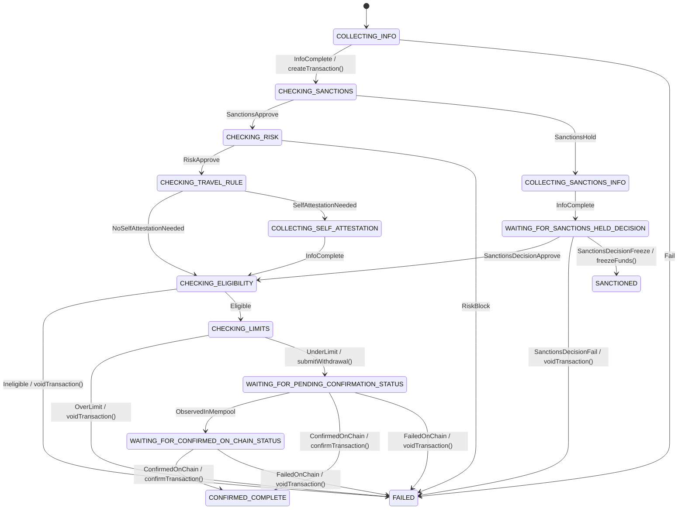

# State Machine Implementation Guide

## Overview

Many services orchestrate complex workflows best modeled as state machines. To make
this easier, we created the open-source [KFSM](https://github.com/block/kfsm) library. Because there are multiple valid
ways to design a state machine, this guide documents our current __best practices__ for modeling, implementing, and
operating them.

## Definitions and naming conventions

### States

__States__ are the named situations a machine can be in over time. While in a state, certain __invariants__ hold, certain __events__
are accepted, and optional __behaviours__ may run. A __transition__ moves the machine to another state when a __trigger__ occurs and
__guards__ pass.

States often represent that:
- the system is __waiting for input__ from a user,
- the system is __waiting for data__ from another service, or
- the system must __perform work__ whose result determines where to go next.

#### Naming

- In-progress: use __present-participle__ verb phrases, e.g. `CHECKING_ELIGIBILITY`, `COLLECTING_INFO`.
- Terminal / outcome: use __past-participle__ or adjectival forms, e.g. `SANCTIONED`, `FAILED`, `CONFIRMED_COMPLETE`.

### Transitions (triggers → state changes)

A __transition__ is the state change from a __source__ state to a __target__ state, taken when a __trigger/event__
happens and the __guard__ is true. While crossing it, the machine may run __effects__ (actions).

#### Naming

- Name transitions after the event that causes the change, e.g. `SanctionsDecisionFreeze`, `Eligible`, `OverLimit`.

### Effects (actions)

An effect is the side-effect or computation the machine performs as part of a transition (or on state entry/exit).
Effects do not choose the branch for the current trigger. Effects should be idempotent and quick; long work
should be modelled as async calls that publish a completion/failure event.

#### Naming

- Name effects using the naming conventions of functions in code (e.g. createTransaction(), voidTransaction(), freezeFunds()).

## Implementation Notes

### Effect types

#### Request/response effects (need a return value)
Example: creating a ledger transaction and receiving a transaction token needed later to confirm/void.
- Implement as RPC; make it idempotent (idempotency key) so the transition can be retried safely.
- Persist any returned identifiers in the machine’s context.

#### Fire-and-forget effects (no return value required)
Example: voiding a transaction, sending a notification.
- Prefer the transactional outbox pattern to guarantee delivery. kFSM provides the core interfaces (`DeferrableEffect`, `OutboxHandler`) while you implement the message processing logic based on your infrastructure needs.

### Error handling

Aim for a balance between safety and customer experience:

- While still interacting with the user (e.g., information collection), prefer failing fast on unexpected errors.
- After a submission (no user in the loop), prefer retrying operations and avoiding terminal failure unless business rules require it.

When exposing a state machine via the [Domain API framework](https://github.com/block/domain-api), error handling typically lives in [Controller](https://github.com/block/domain-api/blob/main/lib/src/main/kotlin/xyz/block/domainapi/util/Controller.kt) classes, through handleFailure(...). Use it to:

- decide whether to fail the business process now, or
- log and continue if the process can make progress later (e.g., via retries/outbox).

## Example

The following is a simplified example of a state machine for a Bitcoin on-chain withdrawal that follows the conventions in this guide:

